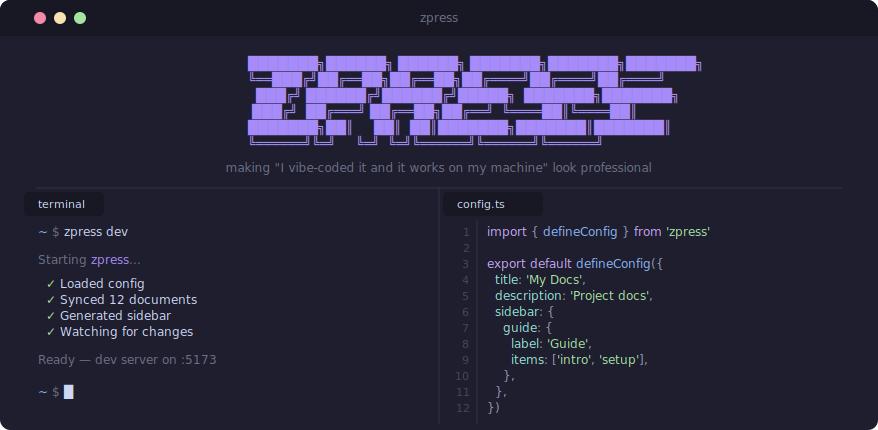

<div align="center">
  
  <p><strong>An opinionated documentation framework for monorepos. Just point it at your code.</strong></p>

<a href="https://github.com/joggrdocs/zpress/actions/workflows/ci.yml"></a>
<a href="https://www.npmjs.com/package/@zpress/kit"></a>
<a href="https://github.com/joggrdocs/zpress/blob/main/LICENSE"></a>

</div>

## Features

- **Your docs, your structure** — Conforms to your repo, not the other way around.
- **Great defaults** — Sidebars, nav, landing pages, and icons from one config.
- **Beautiful themes out of the box** — Dark mode, generated banners, and polished defaults.
- **Monorepo-first** — Built for internal docs with first-class workspace support.

## Install

```bash
npm install @zpress/kit
```

## Usage

### Define your docs

```ts
// zpress.config.ts
import { defineConfig } from '@zpress/kit'

export default defineConfig({
  title: 'my-project',
  description: 'Internal developer docs',
  sections: [
    {
      text: 'Getting Started',
      link: '/getting-started',
      from: 'docs/getting-started.md',
      icon: 'pixelarticons:speed-fast',
    },
    {
      text: 'Guides',
      prefix: '/guides',
      icon: 'pixelarticons:book-open',
      from: 'docs/guides/*.md',
      textFrom: 'heading',
      sort: 'alpha',
    },
  ],
  nav: 'auto',
})
```

### Run it

```bash
npx zpress dev       # start dev server with hot reload
npx zpress build     # build for production
npx zpress serve     # preview production build
```

## Why `@zpress/kit` and not `zpress`?

The package is published as `@zpress/kit` because npm's moniker rules are overly aggressive and ban names that are similar in any way to existing packages. We will fix once we get npm to allow us to push to that namespace. If you work at `npm` please feel free to help out :)

## License

[MIT](LICENSE)
