# Architecture

High-level overview of how zpress is structured, its design philosophy, and how data flows through the system.

## Overview

zpress is a documentation framework for monorepos. It takes a single config file, syncs markdown content into a structured output directory, and builds a static site via [Rspress](https://rspress.dev). The information architecture -- sections, navigation, sidebar, landing pages -- is derived entirely from the config.

The codebase follows a functional, immutable, composition-first design. There are no classes, no `let`, no `throw` statements, and no loops. Errors are returned as `Result` tuples. Side effects (process exit, terminal output) are pushed to the outermost edges.

## Package Ecosystem

```
packages/
├── core/            # Sync engine, config loading, sidebar/nav generation
├── cli/             # CLI commands (sync, dev, build, serve, clean)
├── ui/              # Rspress plugin, theme components, styles
└── zpress/       # @zpress/kit — public wrapper (re-exports core + ui + cli)
```

| Package        | Purpose                                                        |
| -------------- | -------------------------------------------------------------- |
| `@zpress/core` | Config loading, entry resolution, sync engine, sidebar/nav gen |
| `@zpress/cli`  | CLI commands: sync, dev, build, serve, clean, setup, dump      |
| `@zpress/ui`   | Rspress plugin, React theme components, CSS overrides          |
| `@zpress/kit`  | Public package: re-exports everything + provides the CLI bin   |

### `@zpress/kit` (wrapper)

The public-facing package. Two entry points and a CLI bin:

| Entry      | Purpose                                   |
| ---------- | ----------------------------------------- |
| `.`        | Full API: core types + sync + UI + plugin |
| `./config` | Lightweight: just `defineConfig` + types  |

The `zpress` CLI bin is provided by this package and delegates to `@zpress/cli`. Users import `defineConfig` from `@zpress/kit` (or `@zpress/kit/config`) in their config file.

## Layers

```mermaid
%%{init: {
  'theme': 'base',
  'themeVariables': {
    'primaryColor': '#313244',
    'primaryTextColor': '#cdd6f4',
    'primaryBorderColor': '#6c7086',
    'lineColor': '#89b4fa',
    'secondaryColor': '#45475a',
    'tertiaryColor': '#1e1e2e',
    'background': '#1e1e2e',
    'mainBkg': '#313244',
    'clusterBkg': '#1e1e2e',
    'clusterBorder': '#45475a'
  },
  'flowchart': { 'curve': 'basis', 'padding': 15 }
}}%%
flowchart TB
    subgraph cli ["CLI Layer"]
        SYNC(["sync"])
        DEV(["dev"])
        BUILD(["build"])
        SERVE(["serve"])
        CLEAN(["clean"])
    end

    subgraph core ["Core Layer"]
        CONFIG(["config"])
        RESOLVE(["resolve"])
        COPY(["copy"])
        SIDEBAR(["sidebar"])
        NAV(["nav"])
        HOME(["home"])
        MANIFEST(["manifest"])
    end

    subgraph ui ["UI Layer"]
        PLUGIN(["plugin"])
        THEME(["theme"])
        RSPRESS_CFG(["rspress config"])
    end

    subgraph output [".zpress/"]
        CONTENT(["content/"])
        GENERATED(["generated/"])
        DIST(["dist/"])
    end

    DEV & BUILD --> SYNC
    SYNC --> CONFIG --> RESOLVE --> COPY --> CONTENT
    RESOLVE --> SIDEBAR & NAV & HOME --> GENERATED
    RSPRESS_CFG --> GENERATED
    PLUGIN & THEME --> DIST

    classDef core fill:#313244,stroke:#89b4fa,stroke-width:2px,color:#cdd6f4
    classDef gateway fill:#313244,stroke:#fab387,stroke-width:2px,color:#cdd6f4
    classDef agent fill:#313244,stroke:#a6e3a1,stroke-width:2px,color:#cdd6f4
    classDef external fill:#313244,stroke:#f5c2e7,stroke-width:2px,color:#cdd6f4

    class SYNC,DEV,BUILD,SERVE,CLEAN external
    class CONFIG,RESOLVE,COPY,SIDEBAR,NAV,HOME,MANIFEST core
    class PLUGIN,THEME,RSPRESS_CFG agent
    class CONTENT,GENERATED,DIST gateway

    style cli fill:#181825,stroke:#f5c2e7,stroke-width:2px
    style core fill:#181825,stroke:#89b4fa,stroke-width:2px
    style ui fill:#181825,stroke:#a6e3a1,stroke-width:2px
    style output fill:#181825,stroke:#fab387,stroke-width:2px
```



### CLI Layer

**Package:** `@zpress/cli`

The command-line interface. Uses yargs for argument parsing and `@clack/prompts` for styled terminal output. Commands orchestrate the core sync engine and Rspress build APIs.

### Core Layer

**Package:** `@zpress/core`

The sync engine and config system. This is where the information architecture is resolved:

| Module                   | Purpose                                                   |
| ------------------------ | --------------------------------------------------------- |
| `config.ts`              | Config file discovery and loading via c12                 |
| `define-config.ts`       | Config validation at the boundary                         |
| `paths.ts`               | Path constants for `.zpress/` output structure            |
| `sync/index.ts`          | Main sync pipeline orchestrator                           |
| `sync/resolve/index.ts`  | Entry tree resolution (globs, text derivation, sorting)   |
| `sync/copy.ts`           | Page writing with frontmatter injection and hash tracking |
| `sync/sidebar/index.ts`  | Sidebar and nav JSON generation                           |
| `sync/sidebar/multi.ts`  | Multi-sidebar namespace building                          |
| `sync/sidebar/inject.ts` | Virtual landing page generation (MDX)                     |
| `sync/home.ts`           | Default home page generation                              |
| `sync/workspace.ts`      | Workspace item synthesis and card enrichment              |
| `sync/manifest.ts`       | Incremental sync tracking via content hashes              |

### UI Layer

**Package:** `@zpress/ui`

The Rspress theme and plugin:

| Module             | Purpose                                              |
| ------------------ | ---------------------------------------------------- |
| `plugin.ts`        | Rspress plugin: registers global UI components       |
| `config.ts`        | Rspress config factory: loads generated JSON, themes |
| `theme/index.tsx`  | Theme entry: re-exports Rspress base + custom styles |
| `theme/components` | React components: sidebar, home, workspace cards     |
| `theme/icons`      | Iconify icon mappings for tech tags                  |
| `theme/styles`     | CSS overrides for Rspress default theme              |

## Sync Engine

The sync engine is the heart of zpress. It transforms a config file into a complete documentation site structure.

### Pipeline

The `sync()` function in `packages/core/src/sync/index.ts` runs this pipeline:

1. **Setup** -- Create output directories, seed default assets, load previous manifest
2. **Workspace synthesis** -- Convert `apps`/`packages`/`workspaces` into entry sections
3. **Resolve entries** -- Walk the config tree, resolve globs, derive text, merge frontmatter
4. **Enrich cards** -- Attach workspace metadata (icon, scope, tags, badge) to matched entries
5. **Inject landing pages** -- Generate virtual MDX pages for sections with children but no page
6. **Collect pages** -- Flatten the resolved tree into a flat page list
7. **Generate home** -- Create default home page from config metadata (when no explicit index.md)
8. **Copy pages** -- Write all pages with injected frontmatter, track SHA256 hashes
9. **Generate sidebar + nav** -- Build multi-sidebar JSON and nav array
10. **Clean stale files** -- Remove files present in old manifest but absent in new
11. **Save manifest** -- Record file hashes for incremental sync on next run

Returns: `{ pagesWritten, pagesSkipped, pagesRemoved, elapsed }`

### Entry Resolution

The entry resolver (`sync/resolve/index.ts`) recursively walks the config tree and resolves each entry:

- **Single file** -- Source file with explicit link (e.g., `from: 'docs/getting-started.md'`)
- **Virtual page** -- Generated content with link (e.g., `content: () => '# Hello'`)
- **Glob section** -- Pattern that discovers files (e.g., `from: 'docs/guides/*.md'`)
- **Recursive glob** -- Directory-driven nesting (e.g., `from: 'docs/**/*.md', recursive: true`)
- **Explicit items** -- Hand-written child entries

Text derivation is configurable via `textFrom`:

| Value           | Source                                     |
| --------------- | ------------------------------------------ |
| `'filename'`    | Kebab-case filename → title case (default) |
| `'heading'`     | First `#` heading in the markdown file     |
| `'frontmatter'` | `title` field from YAML frontmatter        |

### Incremental Sync

Every page is tracked in a manifest (`manifest.json`) with its SHA256 content hash. On subsequent syncs, pages with unchanged hashes are skipped. Stale files (present in old manifest but not new) are removed. This enables fast re-syncs during development.

### Multi-Sidebar

zpress generates a multi-sidebar structure for Rspress. Root entries share the `/` namespace. Isolated sections (workspace items, explicit `isolated: true`) get their own namespace (e.g., `/apps/api/`). This allows each section to have an independent sidebar tree.

## Config System

The config file (`zpress.config.ts`) is the single source of truth for the entire documentation site:

```ts
import { defineConfig } from '@zpress/kit'

export default defineConfig({
  title: 'My Docs',
  description: 'Platform documentation',
  tagline: 'A short tagline for the hero section',
  sections: [
    /* entry tree */
  ],
  apps: [
    /* workspace items */
  ],
  packages: [
    /* workspace items */
  ],
  nav: 'auto',
})
```

| Field         | Purpose                                           |
| ------------- | ------------------------------------------------- |
| `title`       | Site title, used in hero and metadata             |
| `description` | Site description for SEO                          |
| `tagline`     | Hero section subtitle                             |
| `sections`    | Entry tree defining the information architecture  |
| `apps`        | Workspace items for application docs              |
| `packages`    | Workspace items for shared package docs           |
| `workspaces`  | Custom workspace groups                           |
| `nav`         | Top-level navigation (`'auto'` or explicit array) |

Config is loaded via [c12](https://github.com/unjs/c12) and validated at the boundary in `defineConfig()`. Validation errors exit immediately with a descriptive message.

## Output Structure

The sync engine writes everything to `.zpress/`:

```
.zpress/
├── content/                 # Synced markdown + generated MDX
│   ├── index.md             # Home page (auto-generated or from source)
│   ├── getting-started.md
│   ├── guides/
│   └── .generated/          # Machine-generated metadata
│       ├── sidebar.json     # Multi-sidebar config
│       ├── nav.json         # Top-level navigation
│       ├── workspaces.json  # Workspace data for home page
│       └── manifest.json    # Sync state (file hashes)
├── public/                  # Static assets (logos, icons)
├── dist/                    # Build output (HTML, CSS, JS)
└── cache/                   # Rspress build cache
```

## Data Flow

```mermaid
%%{init: {
  'theme': 'base',
  'themeVariables': {
    'primaryColor': '#313244',
    'primaryTextColor': '#cdd6f4',
    'primaryBorderColor': '#6c7086',
    'lineColor': '#89b4fa',
    'secondaryColor': '#45475a',
    'tertiaryColor': '#1e1e2e',
    'actorBkg': '#313244',
    'actorBorder': '#89b4fa',
    'actorTextColor': '#cdd6f4',
    'signalColor': '#cdd6f4',
    'signalTextColor': '#cdd6f4'
  }
}}%%
sequenceDiagram
    participant User as zpress.config.ts
    participant CLI as CLI
    participant Sync as Sync Engine
    participant FS as .zpress/
    participant Rspress as Rspress

    rect rgb(49, 50, 68)
        Note over User,CLI: Load & Validate
        CLI->>User: Load config via c12
        User-->>CLI: Validated config
    end

    rect rgb(49, 50, 68)
        Note over CLI,FS: Sync
        CLI->>Sync: sync(config, paths)
        Sync->>Sync: Resolve entries (globs, text, frontmatter)
        Sync->>Sync: Generate sidebar + nav JSON
        Sync->>Sync: Inject landing pages (MDX)
        Sync->>FS: Write content/ + .generated/
    end

    rect rgb(49, 50, 68)
        Note over FS,Rspress: Build
        CLI->>Rspress: build() or dev()
        Rspress->>FS: Read content + sidebar + nav
        Rspress->>Rspress: Render with zpress theme
        Rspress-->>FS: Write dist/ (static site)
    end
```



### Step-by-step

1. **Load config** -- c12 discovers and parses `zpress.config.ts`
2. **Validate** -- `defineConfig()` validates structure, exits on first error
3. **Sync entries** -- Resolve globs, derive text, merge frontmatter, deduplicate
4. **Generate metadata** -- Sidebar JSON, nav JSON, workspace data, home page
5. **Write content** -- Copy/generate all pages to `.zpress/content/` with frontmatter injection
6. **Build** -- Rspress reads the generated content and metadata, renders with zpress theme
7. **Output** -- Static HTML/CSS/JS written to `.zpress/dist/`

## Error Handling

zpress uses the `Result<T, E>` tuple pattern for expected failures:

| Layer     | Strategy                      | Type                               |
| --------- | ----------------------------- | ---------------------------------- |
| Core/sync | `Result<T, E>` tuples         | `[error, null]` or `[null, value]` |
| Config    | Validate-and-exit at boundary | `process.exit(1)` with message     |
| CLI       | Catch and report              | `@clack/prompts` error display     |

**Result tuples** are used for operations that can fail (config parsing, file I/O, glob resolution):

```ts
const [error, config] = loadConfig(workspace)
if (error) return [error, null]
```

**Config validation** exits immediately in `defineConfig()` -- config errors are always fatal because nothing can proceed without a valid config.

## Design Decisions

1. **Config is the information architecture** -- A single file defines content structure, routing, navigation, and metadata. No separate sidebar/nav config files.
2. **Factories over classes** -- All components are factory functions returning plain objects.
3. **Result tuples over throw** -- Expected failures use `Result<T, E>`. No exceptions.
4. **Incremental sync** -- SHA256 hashes skip unchanged pages. Manifest comparison removes stale files.
5. **Virtual pages via MDX** -- Landing pages are generated at sync time as MDX with React components.
6. **Multi-sidebar from config** -- Isolated sections get independent sidebar namespaces automatically.
7. **Glob-driven content discovery** -- Patterns auto-discover files without manual entry per page.
8. **Frontmatter inheritance** -- Entries inherit frontmatter from ancestors in the config tree.

## References

- [CLI](./cli.md)
- [Coding Style](../standards/typescript/coding-style.md)
- [Design Patterns](../standards/typescript/design-patterns.md)
- [Errors](../standards/typescript/errors.md)
