# Dev Mode

The watch loop that powers `zpress dev` -- file watching, incremental resyncs, and Rspress hot reload.

## Overview

Dev mode combines three systems: an initial full sync, a file watcher that triggers incremental resyncs, and a Rspress dev server that picks up content changes via HMR. The watcher is the orchestrator -- it decides what kind of sync to run and whether to restart Rspress.

```mermaid
%%{init: {
  'theme': 'base',
  'themeVariables': {
    'primaryColor': '#313244',
    'primaryTextColor': '#cdd6f4',
    'primaryBorderColor': '#6c7086',
    'lineColor': '#89b4fa',
    'secondaryColor': '#45475a',
    'tertiaryColor': '#1e1e2e',
    'actorBkg': '#313244',
    'actorBorder': '#89b4fa',
    'actorTextColor': '#cdd6f4',
    'signalColor': '#cdd6f4',
    'signalTextColor': '#cdd6f4'
  }
}}%%
sequenceDiagram
    participant W as Watcher
    participant S as Sync Engine
    participant R as Rspress
    participant B as Browser

    rect rgb(49, 50, 68)
        Note over W,R: Markdown change
        W->>W: Debounce 150ms
        W->>S: Incremental sync
        S-->>W: Pages written/skipped
        Note over S,R: Rspress detects file changes
        R->>B: HMR update
    end

    rect rgb(49, 50, 68)
        Note over W,R: Config change
        W->>W: Debounce 150ms
        W->>W: Reload config + clear caches
        W->>S: Full sync
        S-->>W: Pages written
        W->>R: Restart dev server
        R->>B: Full reload
    end
```



## Lifecycle

```text
1. Parse args (@kidd-cli/core)
2. Resolve paths (.zpress/)
3. Load config (c12)
4. Clean (optional: remove cache/content/dist)
5. Create shared OpenAPI cache
6. Run initial sync (full)
7. Start Rspress dev server (:6174)
8. Create file watcher (fs.watch, recursive: true)
9. Enter watch loop
```

## File Watching

The watcher (`packages/cli/src/lib/watcher.ts`) uses Node.js native `fs.watch` with `recursive: true` -- a single FSEvents subscription on macOS, a single inotify recursive watch on Linux (Node 22+). It monitors the entire repo root and filters events in the callback.

**Ignored directories:** `node_modules`, `.git`, `.zpress`, `dist`, `.turbo`, `bundle`

### Trigger Table

| Event                                     | Trigger        | What happens                                                                  |
| ----------------------------------------- | -------------- | ----------------------------------------------------------------------------- |
| `.md`/`.mdx` change                       | 150ms debounce | Incremental `sync()` -- unchanged pages skipped via mtime + content hash      |
| `zpress.config.*` change (repo root only) | 150ms debounce | Reload config, full `sync()`, restart Rspress dev server (clears build cache) |
| OpenAPI spec change (`.yaml`/`.json`)     | --             | Not watched -- restart `dev` or trigger a config change to re-parse           |
| Non-markdown file change                  | --             | Ignored                                                                       |
| Files in ignored dirs                     | --             | Dropped silently                                                              |

## Concurrency

If a sync is already running, the next change queues a pending resync. Config reload state is tracked across queued syncs so a content change followed by a config change still triggers a full reload. After 5 consecutive sync failures, pending resyncs are dropped until the next file change.

## Rspress Restart

When a config change triggers a reload, the watcher invokes `onConfigReload` after sync completes. This restarts the Rspress dev server with a fresh config (disabling persistent build cache so title/theme/color changes take effect). Content-only changes do not restart Rspress -- its HMR picks up the updated files directly from `.zpress/content/`.

## OpenAPI Cache

A shared `Map<string, unknown>` is created once in the `dev` command and threaded through all sync passes. Dereferenced OpenAPI specs persist in the cache across resyncs, avoiding expensive re-parsing on content-only changes. The cache is cleared on config reload to force re-parsing.

## References

- [Engine Overview](./overview.md)
- [Pipeline](./pipeline.md)
- [Incremental Sync](./incremental.md)
- [OpenAPI Sync](./openapi.md)
- [CLI Reference](../../references/cli.md)
