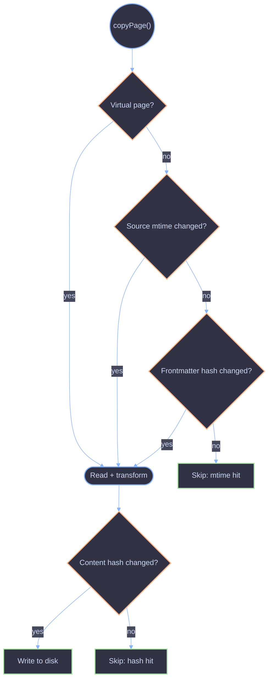

# Incremental Sync

Manifest-based skip logic that makes `zpress dev` fast after the initial sync.

## Overview

The engine tracks per-file metadata in a manifest to skip redundant work on subsequent syncs. Only changed pages go through the full read/transform/hash pipeline. This is what makes the dev watch loop responsive -- a single markdown edit triggers an incremental sync that skips all unchanged pages.

## Skip Decision Tree

Pages with no previous manifest entry (new pages) and pages with missing `frontmatterHash` in the manifest (first sync after upgrade) always go through the full pipeline.

## Skip Layers

The manifest enables multiple skip layers, ordered cheapest to most expensive:

| Check                                   | What's skipped                      | Cost                          |
| --------------------------------------- | ----------------------------------- | ----------------------------- |
| Source `mtime` + frontmatter hash match | Entire read/transform/hash pipeline | `fs.stat` + MD5 comparison    |
| Content hash unchanged (post-transform) | File write to disk                  | SHA-256 of transformed output |
| Asset config hash unchanged             | All SVG generation                  | SHA-256 comparison            |
| Image destination `mtime` >= source     | `copyFile` for that image           | `fs.stat` (1 syscall)         |
| OpenAPI spec `mtime` unchanged          | `SwaggerParser.dereference`         | `fs.stat` (1 syscall)         |

## Structural Change Detection

When the total page count (`resolvedCount`) changes between syncs, a structural change has occurred -- a page was added or removed. Mtime-based skipping is disabled for one pass to ensure all pages go through the full pipeline. This handles cases where a new page affects link rewriting or sidebar structure.

After the full pass completes, the new `resolvedCount` is saved and mtime skipping resumes on the next sync.

## Stale File Cleanup

After every sync, files present in the old manifest but absent in the new one are removed from the output directory. Empty parent directories are pruned afterwards.

## Manifest Shape

The manifest (`sync/manifest.ts`) stores:

| Field             | Purpose                                                                                                 |
| ----------------- | ------------------------------------------------------------------------------------------------------- |
| `files`           | Per-page entries keyed by `outputPath`: `contentHash`, `sourceMtime`, `frontmatterHash` (MD5), `source` |
| `assetConfigHash` | SHA-256 of serialized asset config (title, tagline)                                                     |
| `openapiMtimes`   | Per-spec mtime for OpenAPI skip checks                                                                  |
| `resolvedCount`   | Total page count for structural change detection                                                        |

## References

- [Engine Overview](./overview.md)
- [Pipeline](./pipeline.md)
- [OpenAPI Sync](./openapi.md)
- [Dev Mode](./dev.md)
