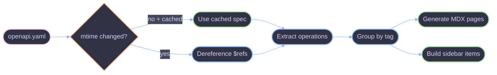

# OpenAPI Sync

Transforms OpenAPI specs into browsable MDX pages with interactive components.

## Overview

The OpenAPI sync (`sync/openapi.ts`) is a sub-pipeline bolted onto the main sync engine. It collects specs from the config, dereferences `$ref`s, generates one MDX page per operation, and builds sidebar items grouped by tag.

## Steps

| #   | Step               | What it does                                                                                                                  |
| --- | ------------------ | ----------------------------------------------------------------------------------------------------------------------------- |
| 1   | Collect configs    | Gather OpenAPI configs from root `config.openapi` and entry-level `openapi` fields (`apps`, `packages`, and workspace items)  |
| 2   | Check mtime        | Stat the spec file and compare its mtime to the previous manifest to decide whether a shared cached dereference can be reused |
| 3   | Dereference        | Resolve all `$ref`s via `@apidevtools/swagger-parser` (or use cached result)                                                  |
| 4   | Extract operations | Pull operations from paths, group by tag                                                                                      |
| 5   | Generate MDX       | One `.mdx` per operation (renders `<OpenAPIOperation>`) + overview page (`<OpenAPIOverview>`)                                 |
| 6   | Build sidebar      | Sidebar items grouped by tag with configurable layout (`method-path` or `title`)                                              |
| 7   | Emit spec          | Emit dereferenced spec as a virtual `openapi.json` page (written by the sync engine's copy step)                              |

## Caching

In dev mode, a shared `Map<string, unknown>` is created once and threaded through all sync passes. See [Dev Mode — OpenAPI Cache](./dev.md#openapi-cache) for lifecycle details.

## References

- [Engine Overview](./overview.md)
- [Pipeline](./pipeline.md)
- [Incremental Sync](./incremental.md)
- [Dev Mode](./dev.md)
