# Engine

The materialization layer that transforms `zpress.config.ts` into a Rspress-compatible documentation site.

## Overview

The engine reads a declarative config, discovers markdown files via globs, resolves the information architecture (sidebar, nav, landing pages), and writes everything into `.zpress/content/`. Rspress only consumes the engine's output in `.zpress/content/`.

```mermaid
%%{init: {
  'theme': 'base',
  'themeVariables': {
    'primaryColor': '#313244',
    'primaryTextColor': '#cdd6f4',
    'primaryBorderColor': '#6c7086',
    'lineColor': '#89b4fa',
    'secondaryColor': '#45475a',
    'tertiaryColor': '#1e1e2e',
    'background': '#1e1e2e',
    'mainBkg': '#313244',
    'clusterBkg': '#1e1e2e',
    'clusterBorder': '#45475a'
  },
  'flowchart': { 'curve': 'basis', 'padding': 15 }
}}%%
flowchart LR
    subgraph input ["Input"]
        CONFIG(["zpress.config.ts"])
        MD(["*.md / *.mdx"])
        SPECS(["openapi.yaml"])
    end

    subgraph engine ["Engine"]
        RESOLVE(["resolve"])
        TRANSFORM(["transform"])
        GENERATE(["generate"])
    end

    subgraph output [".zpress/content/"]
        CONTENT(["pages"])
        META([".generated/"])
        IMAGES(["images"])
    end

    CONFIG --> RESOLVE
    MD --> TRANSFORM
    SPECS --> GENERATE
    RESOLVE --> TRANSFORM --> CONTENT
    RESOLVE --> META
    TRANSFORM --> IMAGES
    GENERATE --> CONTENT

    classDef external fill:#313244,stroke:#f5c2e7,stroke-width:2px,color:#cdd6f4
    classDef core fill:#313244,stroke:#89b4fa,stroke-width:2px,color:#cdd6f4
    classDef agent fill:#313244,stroke:#a6e3a1,stroke-width:2px,color:#cdd6f4

    class CONFIG,MD,SPECS external
    class RESOLVE,TRANSFORM,GENERATE core
    class CONTENT,META,IMAGES agent

    style input fill:#181825,stroke:#f5c2e7,stroke-width:2px
    style engine fill:#181825,stroke:#89b4fa,stroke-width:2px
    style output fill:#181825,stroke:#a6e3a1,stroke-width:2px
```



## Key Concepts

- **Config-driven** -- The config defines the entire information architecture. No separate sidebar or nav config files.
- **Glob-driven discovery** -- Patterns auto-discover files without manual entry per page.
- **Virtual pages** -- Landing pages and home pages are generated as MDX at sync time.
- **Multi-sidebar** -- Root entries share `/`, isolated sections get their own namespace (e.g., `/apps/api/`).
- **Incremental** -- Mtime checks, content hashes, and config hashes skip unchanged work between syncs.

## Build vs Dev

**Build** (`zpress build`) runs a single sync pass:

```
loadConfig() --> sync() --> createRspressConfig() --> rspress build() --> .zpress/dist/
```

**Dev** (`zpress dev`) runs sync then enters a watch loop:

```
loadConfig() --> sync() --> createRspressConfig() --> rspress dev() --> watcher
```

After initial sync, the watcher monitors the repo and triggers incremental resyncs. See [Dev Mode](./dev.md) for how the watch loop works.

## Topics

| Topic | What it covers |
| --- | --- |
| [Pipeline](./pipeline.md) | The sync pipeline, page transformation, entry resolution, multi-sidebar |
| [Incremental Sync](./incremental.md) | Mtime-based skipping, content hashing, structural change detection |
| [OpenAPI Sync](./openapi.md) | Spec dereferencing, MDX generation, sidebar building |
| [Dev Mode](./dev.md) | File watching, debouncing, HMR, config reload, concurrency |

## References

- [Architecture](../architecture.md)
- [Config](../config.md)
- [CLI Reference](../../references/cli.md)
