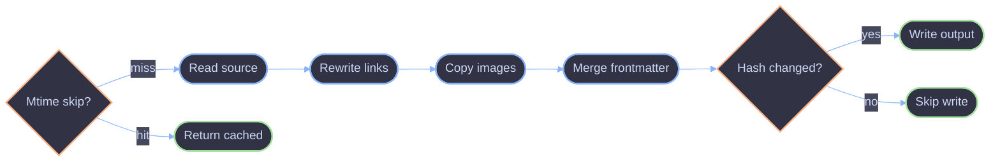

# Pipeline

The sync pipeline that transforms config into content.

## Overview

The `sync()` function in `packages/core/src/sync/index.ts` runs a four-phase pipeline: setup, resolve, write, and generate. This expands the three-phase model from the [Engine Overview](./overview.md) into the individual steps that run within each phase.

```mermaid
%%{init: {
  'theme': 'base',
  'themeVariables': {
    'primaryColor': '#313244',
    'primaryTextColor': '#cdd6f4',
    'primaryBorderColor': '#6c7086',
    'lineColor': '#89b4fa',
    'secondaryColor': '#45475a',
    'tertiaryColor': '#1e1e2e',
    'background': '#1e1e2e',
    'mainBkg': '#313244',
    'clusterBkg': '#1e1e2e',
    'clusterBorder': '#45475a'
  },
  'flowchart': { 'curve': 'basis', 'padding': 15 }
}}%%
flowchart TB
    subgraph setup ["Setup"]
        S1(["1. Create dirs"])
        S2(["2. Load manifest"])
        S3(["3. Generate assets"])
        S4(["4. Copy public/"])
    end

    subgraph resolve ["Resolve"]
        S5(["5. Synthesize workspaces"])
        S6(["6. Resolve entries"])
        S7(["7. Enrich cards"])
        S8(["8. Inject landing pages"])
        S9(["9. Collect pages"])
        S10(["10. Write workspace data"])
        S11(["11. Generate home"])
        S12(["12. Discover planning pages"])
        S13(["13. OpenAPI sync"])
    end

    subgraph write ["Write"]
        S14(["14. Copy pages"])
        S15(["15. Clean stale files"])
    end

    subgraph generate ["Generate"]
        S16(["16. Build sidebar + nav"])
        S17(["17. Save manifest"])
        S18(["18. Write README"])
    end

    setup --> resolve --> write --> generate

    classDef core fill:#313244,stroke:#89b4fa,stroke-width:2px,color:#cdd6f4
    classDef gateway fill:#313244,stroke:#fab387,stroke-width:2px,color:#cdd6f4
    classDef agent fill:#313244,stroke:#a6e3a1,stroke-width:2px,color:#cdd6f4
    classDef external fill:#313244,stroke:#f5c2e7,stroke-width:2px,color:#cdd6f4

    class S1,S2,S3,S4 external
    class S5,S6,S7,S8,S9,S10,S11,S12,S13 core
    class S14,S15 gateway
    class S16,S17,S18 agent

    style setup fill:#181825,stroke:#f5c2e7,stroke-width:2px
    style resolve fill:#181825,stroke:#89b4fa,stroke-width:2px
    style write fill:#181825,stroke:#fab387,stroke-width:2px
    style generate fill:#181825,stroke:#a6e3a1,stroke-width:2px
```

## Steps

| # | Step | Phase | What it does |
| --- | --- | --- | --- |
| 1 | Create dirs | Setup | Create `.zpress/content/` and `.generated/` directories |
| 2 | Load manifest | Setup | Load previous sync manifest for incremental diffing |
| 3 | Generate assets | Setup | Generate branded SVG assets (conditional -- skipped when asset config hash unchanged) |
| 4 | Copy public/ | Setup | Copy `.zpress/public/` into content dir for Rspress |
| 5 | Synthesize workspaces | Resolve | Convert `apps`/`packages`/`workspaces` into entry sections |
| 6 | Resolve entries | Resolve | Walk config tree, resolve globs, derive text, merge frontmatter |
| 7 | Enrich cards | Resolve | Attach workspace metadata (icon, scope, tags, badge) |
| 8 | Inject landing pages | Resolve | Generate virtual MDX for sections with children but no page |
| 9 | Collect pages | Resolve | Flatten the resolved tree into a flat page list |
| 10 | Write workspace data | Resolve | Serialize workspace metadata to `.generated/workspaces.json` |
| 11 | Generate home | Resolve | Create default home page from config metadata (when no explicit index.md) |
| 12 | Discover planning pages | Resolve | Resolve pages from `.planning/` directory (included in output, excluded from sidebar/nav) |
| 13 | OpenAPI sync | Resolve | Dereference specs, generate `.mdx` per operation |
| 14 | Copy pages | Write | Write pages with injected frontmatter, rewrite links, track hashes (parallel) |
| 15 | Clean stale files | Write | Remove files present in old manifest but absent in new; prune empty directories |
| 16 | Build sidebar + nav | Generate | Build multi-sidebar JSON and nav array |
| 17 | Save manifest | Generate | Record file hashes and incremental metadata |
| 18 | Write README | Generate | Write bare-bones README to `.zpress/` root |

Returns: `{ pagesWritten, pagesSkipped, pagesRemoved, elapsed }` (elapsed in milliseconds)

## Page Transformation

Each page passes through `copyPage()` (`sync/copy.ts`):

1. **Mtime skip check** -- If source mtime and frontmatter hash match the previous manifest, return the cached entry (see [Incremental Sync](./incremental.md))
2. Read source file (or evaluate virtual content)
3. Rewrite relative markdown links using source-to-output path map
4. Copy referenced images to `content/public/images/`, rewrite paths to `/images/<name>-<hash>.<ext>` (8-char MD5 of the image path)
5. Merge frontmatter (config defaults + source frontmatter, source wins)
6. SHA-256 content hash -- skip write if unchanged from previous manifest
7. Write final markdown/MDX to `.zpress/content/`

## Entry Resolution

The entry resolver (`sync/resolve/index.ts`) recursively walks the config tree and resolves each entry:

| Entry type | Description | Example |
| --- | --- | --- |
| Single file | Source file with explicit link | `include: 'docs/getting-started.md'` |
| Virtual page | Generated content | `content: () => '# Hello'` |
| Glob section | Pattern that discovers files | `include: 'docs/guides/*.md'` |
| Recursive glob | Directory-driven nesting | `include: 'docs/**/*.md', recursive: true` |
| Explicit items | Hand-written child entries | `items: [{ text: '...', include: '...' }]` |

### Text Derivation

Text derivation is configurable via the `title` field's `from` property:

| Value | Source |
| --- | --- |
| `'auto'` | Frontmatter title, then first `#` heading, then filename (default) |
| `'filename'` | Kebab-case filename to title case |
| `'heading'` | First `#` heading in the markdown file |
| `'frontmatter'` | `title` from YAML frontmatter, falling back to heading, then filename |

## Multi-Sidebar

zpress generates a multi-sidebar structure for Rspress. Root entries share the `/` namespace. Isolated sections (workspace items, explicit `isolated: true`) get their own namespace (e.g., `/apps/api/`). Each isolated section has an independent sidebar tree.

## References

- [Engine Overview](./overview.md)
- [Incremental Sync](./incremental.md)
- [OpenAPI Sync](./openapi.md)
- [Dev Mode](./dev.md)
