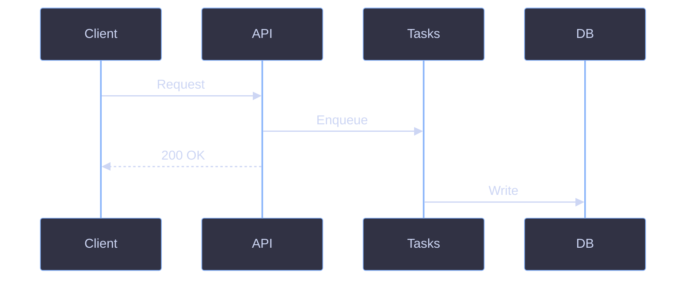
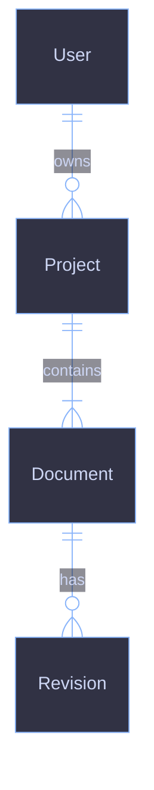

# Diagram Standards

## Overview

All diagrams use **Mermaid** with the **Catppuccin Mocha** color theme. This creates a cohesive dark-mode aesthetic that renders well on GitHub and in the zpress site. File tree structures use ` ```tree ` code blocks that render as interactive, collapsible trees on the site (see [Use Tree Blocks for File Trees](#use-tree-blocks-for-file-trees)).

### Rendering Plugins

Both Mermaid diagrams and file trees are rendered by Rspress plugins registered in `packages/ui/src/config.ts`:

| Plugin                     | Syntax                          | Purpose                                             |
| -------------------------- | ------------------------------- | --------------------------------------------------- |
| `rspress-plugin-mermaid`   | ` ```mermaid `                  | Renders Mermaid diagrams (flowcharts, sequence, ER) |
| `rspress-plugin-file-tree` | ` ```tree `                     | Renders interactive collapsible file trees          |
| `rspress-plugin-supersub`  | `^superscript^` / `~subscript~` | Superscript and subscript text                      |
| `rspress-plugin-katex`     | `$inline$` / `$$block$$`        | Renders math formulas with KaTeX                    |

Mermaid and tree blocks also render natively on GitHub — GitHub supports ` ```mermaid ` blocks, and ` ```tree ` blocks display as readable plain text.

## Rules

### Choose the Right Diagram Type

| Concept                                      | Diagram Type           | Example                                 |
| -------------------------------------------- | ---------------------- | --------------------------------------- |
| System architecture, data pipelines, routing | Flowchart              | Webhook routing, dependency chains      |
| Request/response flows, multi-step protocols | Sequence diagram       | OAuth handshakes, API request lifecycle |
| Database models, entity relationships        | ER diagram             | Data model, authorization schema        |
| Directory layouts                            | File tree (Tree block) | Repository structure                    |

Rule of thumb:

- **Flowcharts** show structure and routing -- "what connects to what"
- **Sequence diagrams** show ordered interactions -- "what happens in what order"
- **ER diagrams** show data shape -- "what entities exist and how they relate"

If a concept involves both structure and ordering, use a **flowchart** for the routing overview and a **sequence diagram** for the detailed request flow.

### Use the Catppuccin Mocha Color Palette

Based on [Catppuccin Mocha](https://catppuccin.com/palette).

**Base Colors:**

| Name     | Hex       | Usage                                  |
| -------- | --------- | -------------------------------------- |
| Base     | `#1e1e2e` | Background, cluster backgrounds        |
| Surface0 | `#313244` | Node fill (primary)                    |
| Surface1 | `#45475a` | Node fill (secondary), cluster borders |
| Overlay0 | `#6c7086` | Disabled/future elements               |
| Text     | `#cdd6f4` | All text labels                        |

**Accent Colors:**

| Color | Hex       | Usage                              |
| ----- | --------- | ---------------------------------- |
| Pink  | `#f5c2e7` | External systems, inputs, triggers |
| Blue  | `#89b4fa` | Core app components, processing    |
| Green | `#a6e3a1` | Agents, storage, outputs, success  |
| Peach | `#fab387` | Gateways, sandboxes, middleware    |
| Gray  | `#6c7086` | Future/planned, disabled           |

**When to Use Each Color:**

```
Pink (#f5c2e7)   -> External: GitHub, webhooks, user requests
Blue (#89b4fa)   -> Internal: API, Tasks, CLI, core services
Green (#a6e3a1)  -> Data: Storage, outputs, success states
Peach (#fab387)  -> Middleware: Gateways, sandboxes
Gray (#6c7086)   -> Future: Planned features, disabled paths
```

### Follow Flowchart Standards

Copy this template for all flowcharts:


**Node Shapes:**

| Shape     | Syntax        | Usage                      |
| --------- | ------------- | -------------------------- |
| Rounded   | `(["Label"])` | Services, apps, components |
| Database  | `[("Label")]` | Databases, storage         |
| Rectangle | `["Label"]`   | Events, data, generic      |
| Diamond   | `{"Label"}`   | Decisions                  |
| Circle    | `(("Label"))` | Start/end points           |

**Line Styles:**

| Style        | Syntax           | Usage                    |
| ------------ | ---------------- | ------------------------ |
| Solid arrow  | `-->`            | Synchronous, direct flow |
| Dashed arrow | `-.->`           | Async, on-demand, future |
| Labeled      | `-- "label" -->` | Describe the connection  |
| Thick        | `==>`            | Primary/important flow   |

**Class Definitions:**

Add these class definitions and apply with the `class` directive:

```
classDef external fill:#313244,stroke:#f5c2e7,stroke-width:2px,color:#cdd6f4
classDef core fill:#313244,stroke:#89b4fa,stroke-width:2px,color:#cdd6f4
classDef agent fill:#313244,stroke:#a6e3a1,stroke-width:2px,color:#cdd6f4
classDef storage fill:#45475a,stroke:#a6e3a1,stroke-width:2px,color:#cdd6f4
classDef gateway fill:#313244,stroke:#fab387,stroke-width:2px,color:#cdd6f4
classDef future fill:#313244,stroke:#6c7086,stroke-width:2px,stroke-dasharray:3 3,color:#6c7086
```

Apply with the `class` directive -- never use `classDef default`.

**Subgraph Styling:**

| Purpose            | Style                                                            |
| ------------------ | ---------------------------------------------------------------- |
| External systems   | `fill:none,stroke:#f5c2e7,stroke-width:2px,stroke-dasharray:5 5` |
| Core processing    | `fill:none,stroke:#89b4fa,stroke-width:2px,stroke-dasharray:5 5` |
| Main app boundary  | `fill:#181825,stroke:#89b4fa,stroke-width:2px`                   |
| Agent group        | `fill:#181825,stroke:#a6e3a1,stroke-width:2px`                   |
| Storage layer      | `fill:none,stroke:#a6e3a1,stroke-width:2px,stroke-dasharray:5 5` |
| Gateway/middleware | `fill:none,stroke:#fab387,stroke-width:2px,stroke-dasharray:5 5` |

**Flowchart rules:**

- Max 10-15 nodes per diagram
- Prefer LR (left-to-right) or TB for vertical flows
- Use `classDef` + `class` for styling -- never inline `style` on individual nodes
- Use semantic class names (`external`, `core`, `agent`) -- never `classDef default`
- Group related nodes with subgraphs
- Add a legend when using both solid and dashed lines

### Follow Sequence Diagram Standards

Copy this template for all sequence diagrams:



**Participants:**

- Use short aliases with descriptive labels: `participant A as API`
- Order left-to-right by data flow: initiator -> intermediaries -> destination
- Max **7 participants** -- break into multiple diagrams if more are needed

**Messages:**

| Syntax          | Usage                                        |
| --------------- | -------------------------------------------- |
| `->>`           | Synchronous call (solid arrow)               |
| `-->>`          | Response or async return (dashed arrow)      |
| `->>+` / `->>-` | **Do not use** -- activation boxes add noise |

Keep message labels short -- 3-5 words. Use the format `Verb + object`:

```
C->>A: POST /scripts/run
A->>T: Enqueue script task
T->>DB: Write execution result
```

**Grouping with `rect` Blocks:**

Use `rect` blocks to visually group related phases in a flow. Use `rgb(49, 50, 68)` (Surface1) for the background -- not accent colors:

```
rect rgb(49, 50, 68)
    Note over A,B: Phase label
    A->>B: Message
end
```

Guidelines:

- Max **3-4 `rect` blocks** per diagram
- Add a `Note over` annotation inside each block to label the phase
- `rect` blocks cannot be nested

**Control Flow Fragments:**

| Fragment       | Usage           | Example                                       |
| -------------- | --------------- | --------------------------------------------- |
| `alt` / `else` | Branching paths | `alt Script exists` / `else Script not found` |
| `loop`         | Iteration       | `loop For each workspace`                     |
| `opt`          | Optional step   | `opt If config cached`                        |
| `Note over`    | Annotations     | `Note over Runner,DB: Async processing`       |

Guidelines:

- Do not nest fragments more than **2 levels deep**
- `Note over` should span exactly the relevant participants: `Note over A,B: label`
- Do not use `Note left of` or `Note right of` -- use `Note over` for consistency

**Sequence diagram rules:**

- Max **7 participants**, **15-20 messages**
- Do not use `mirrorActors` -- keep participants at the top only
- Do not use activation boxes (`activate`/`deactivate` or `+`/`-`)
- `rect` blocks use `rgb(49, 50, 68)` (Surface1) -- not accent colors
- All sequence diagrams require the full theme init block (11 variables)

### Follow ER Diagram Standards

Copy this template for all ER diagrams:



**When to Include Attributes:**

| Context                           | Attributes                                            | Example                 |
| --------------------------------- | ----------------------------------------------------- | ----------------------- |
| Primary data model reference      | Include full attributes with types, markers, comments | `data/model.md`         |
| Supplementary to text explanation | Omit attributes -- show only relationships            | Overview schema section |
| Focused subset of a larger model  | Include attributes for the entities being discussed   | Access control tables   |

**Attribute Format:**

When including attributes, use: `type name marker "comment"`

```
User {
    string id PK
    string email UK "User email"
    datetime createdAt
}
```

Markers:

| Marker | Meaning     |
| ------ | ----------- |
| `PK`   | Primary key |
| `FK`   | Foreign key |
| `UK`   | Unique key  |

**Relationship Notation:**

Use Mermaid's crow's foot notation:

| Syntax       | Meaning                |
| ------------ | ---------------------- |
| `\|\|--o{`   | One-to-many (optional) |
| `\|\|--\|{`  | One-to-many (required) |
| `\|\|--o\|`  | One-to-one (optional)  |
| `\|\|--\|\|` | One-to-one (required)  |

Label every relationship with a verb:

```
Workspace ||--o{ Script : contains
Script ||--o{ Execution : produces
```

**ER diagram rules:**

- Max **8-10 entities** with attributes, **15 entities** without
- For larger models, split by domain
- All ER diagrams require the theme init block (7 variables)
- Use PascalCase for entity names

### Use Tree Blocks for File Trees

File tree structures use ` ```tree ` fenced code blocks. On the zpress site these render as interactive, collapsible tree components. On GitHub they display as readable plain text.

Use box-drawing characters for tree branches:

```tree
docs/
├── guides/
│   ├── setup-local-env.md
│   └── add-api-route.md
├── standards/
│   ├── documentation/
│   │   ├── writing.md
│   │   └── diagrams.md
│   └── typescript/
│       └── overview.md
└── README.md
```

Characters:

| Character | Name        | Usage                     |
| --------- | ----------- | ------------------------- |
| `├──`     | Branch      | Items with siblings below |
| `└──`     | Last branch | Final item in a directory |
| `│`       | Pipe        | Vertical continuation     |

Guidelines:

- Use consistent indentation (4 spaces per level)
- Keep trees focused -- show only relevant files
- Always use ` ```tree ` -- not ` ``` ` -- so the file tree plugin renders them
- Add comments sparingly if needed: `config.ts  # main config`

### Follow General Rules

These apply to all diagram types:

1. **Always use the theme init block** -- Never use default Mermaid colors
2. **Keep diagrams simple** -- Stay within the complexity limits for each type
3. **Use clear, short labels** -- 1-2 words per node, 3-5 words per message
4. **Break large diagrams up** -- Split into multiple focused diagrams rather than cramming everything into one
5. **Use semantic class names** -- `external`, `core`, `agent`, not `blue`, `pink`, or `default`
6. **No inline `style` on individual nodes** -- Use `classDef` + `class` instead
7. **Consistent node shapes** -- Services = rounded, databases = cylinder, events = rectangle
8. **Add a legend** -- Explain solid vs dashed lines when both are used
9. **No `mirrorActors`** -- Keep participants at the top only
10. **No activation boxes** -- They add noise without clarity
11. **`rect` blocks use `rgb(49, 50, 68)`** -- Not accent colors
12. **PascalCase entity names** -- Match model naming conventions
13. **Label every relationship** -- Use a verb: `User ||--o{ Project : owns`

## Resources

- [Mermaid Documentation](https://mermaid.js.org/)
- [Catppuccin Color Palette](https://catppuccin.com/palette)
- [rspress-plugin-mermaid](https://github.com/rspack-contrib/rspress-plugins/tree/main/packages/rspress-plugin-mermaid)
- [rspress-plugin-file-tree](https://github.com/rspack-contrib/rspress-plugins/tree/main/packages/rspress-plugin-file-tree)
- [rspress-plugin-supersub](https://github.com/rspack-contrib/rspress-plugins/tree/main/packages/rspress-plugin-supersub)
- [rspress-plugin-katex](https://github.com/rspack-contrib/rspress-plugins/tree/main/packages/rspress-plugin-katex)
- [KaTeX Documentation](https://katex.org/docs/supported.html)

## References

- [Writing Standards](./writing.md)
- [Formatting Standards](./formatting.md)
