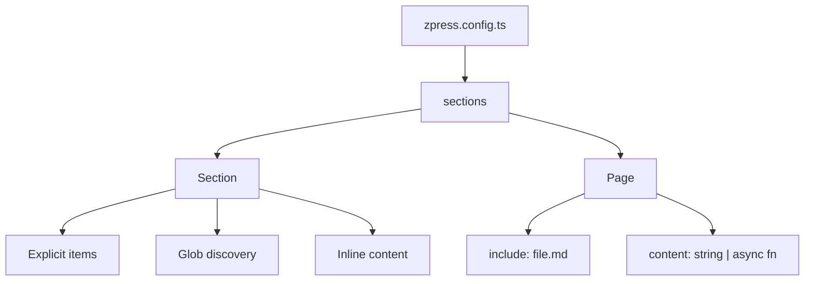

# Content

How documentation is structured, discovered, and enriched with metadata in zpress.

## Overview

Content in zpress is a tree of **sections** and **pages** defined in the `sections` array of your config. Sections group pages under collapsible sidebar headings. Pages map source markdown files (or inline content) to URLs. Together they define your entire information architecture without requiring you to restructure your existing files.



## Pages

A page maps a source markdown file to a URL.

```ts
{
  title: 'Architecture',
  path: '/architecture',
  include: 'docs/architecture.md',
}
```

Pages can use inline content instead of a file:

```ts
{
  title: 'Changelog',
  path: '/changelog',
  content: '# Changelog\n\nSee GitHub releases.',
}
```

Or generate content dynamically at build time:

```ts
{
  title: 'Status',
  path: '/status',
  content: async () => {
    const data = await fetchStatus()
    return `# Status\n\n${data}`
  },
}
```

Use async generators for changelogs pulled from an API, status pages with live data at build time, or generated documentation from schemas.

### Hidden pages

Set `hidden: true` to build and route a page without showing it in the sidebar:

```ts
{
  title: 'Internal Notes',
  path: '/internal/notes',
  include: 'docs/internal/notes.md',
  hidden: true,
}
```

Hidden pages are still accessible by URL and can be linked to from other pages. Use this for redirect targets, utility pages, or pages linked from other content but not worth a sidebar entry.

## Sections

A section groups pages under a collapsible sidebar heading.

### Explicit children

```ts
{
  title: 'Guides',
  items: [
    { title: 'Quick Start', path: '/guides/quick-start', include: 'docs/guides/quick-start.md' },
    { title: 'Deployment', path: '/guides/deployment', include: 'docs/guides/deployment.md' },
  ],
}
```

### Auto-discovered children

Use a glob pattern with `path` to discover pages automatically:

```ts
{
  title: 'Guides',
  path: '/guides',
  include: 'docs/guides/*.md',
}
```

Every `.md` file matching the glob becomes a child page. The URL is derived as `path + "/" + filename-slug`. `path` is required with globs.

### Mixed

Combine explicit entries with auto-discovery. Explicit entries take precedence over glob matches with the same slug:

```ts
{
  title: 'Guides',
  path: '/guides',
  include: 'docs/guides/*.md',
  items: [
    { title: 'Start Here', path: '/guides/start', include: 'docs/intro.md' },
  ],
}
```

## Nesting

Sections can nest arbitrarily. Sections deeper than level 1 are collapsible by default:

```ts
{
  title: 'API',
  items: [
    {
      title: 'Authentication',
      items: [
        { title: 'OAuth', path: '/api/auth/oauth', include: 'docs/api/auth/oauth.md' },
        { title: 'API Keys', path: '/api/auth/keys', include: 'docs/api/auth/keys.md' },
      ],
    },
  ],
}
```

### Recursive directories

For large doc trees that mirror a directory structure, use `recursive: true`:

```ts
{
  title: 'Reference',
  path: '/reference',
  include: 'docs/reference/**/*.md',
  recursive: true,
  entryFile: 'overview',
}
```

This maps directory nesting to sidebar nesting. In each directory, the `entryFile` (default `"overview"`) becomes the section header page.

```
docs/reference/
├── overview.md          → Section header for /reference
├── auth/
│   ├── overview.md      → Section header for /reference/auth
│   ├── oauth.md         → /reference/auth/oauth
│   └── api-keys.md      → /reference/auth/api-keys
└── database/
    ├── overview.md      → Section header for /reference/database
    └── migrations.md    → /reference/database/migrations
```

### Standalone sidebars

By default all sections share one sidebar. Set `standalone: true` to give a section its own sidebar namespace:

```ts
{
  title: 'API Reference',
  path: '/api/',
  standalone: true,
  items: [
    { title: 'Auth', path: '/api/auth', include: 'docs/api/auth.md' },
    { title: 'Users', path: '/api/users', include: 'docs/api/users.md' },
  ],
}
```

When navigating to `/api/`, only that section's sidebar appears.

## Auto-Discovery

Glob patterns let you add pages without updating the config every time a new file is created.

### Title derivation

Control how page titles are derived from discovered files:

| Strategy        | Source                             | Example                                         |
| --------------- | ---------------------------------- | ----------------------------------------------- |
| `'auto'`        | Fallback chain (default)           | Frontmatter → heading → filename                |
| `'filename'`    | Filename converted to title        | `add-api-route.md` → "Add Api Route"            |
| `'heading'`     | First `# heading` in the file      | `# Adding an API Route` → "Adding an API Route" |
| `'frontmatter'` | `title` field in YAML front matter | `title: API Routes` → "API Routes"              |

Default is `'auto'`, which tries frontmatter first, falls back to heading, then filename.

```ts
{
  title: { from: 'frontmatter' },
  path: '/guides',
  include: 'docs/guides/*.md',
}
```

#### Custom transforms

Add a `transform` function for more control. The transform receives the derived title and the filename slug, returning the final display title.

```ts
{
  title: {
    from: 'auto',
    transform: (title, slug) => slug.replace(/^(\d+)-/, '$1. '),
  },
  path: '/adrs',
  include: 'docs/adrs/*.md',
}
```

Transforms only apply to auto-discovered children. Sections with explicit `title` strings are not transformed.

### Sorting

| Strategy      | Behavior                                                                                |
| ------------- | --------------------------------------------------------------------------------------- |
| `'default'`   | Pins intro files (`introduction`, `intro`, `overview`, `readme`) to the top, then alpha |
| `'alpha'`     | Alphabetical by derived text                                                            |
| `'filename'`  | Alphabetical by filename                                                                |
| `(a, b) => n` | Custom comparator on `ResolvedPage`                                                     |

When `sort` is omitted, the `'default'` strategy is used.

### Excluding files

```ts
{
  title: 'Guides',
  path: '/guides',
  include: 'docs/guides/*.md',
  exclude: ['**/draft-*.md', '**/internal/**'],
}
```

Global excludes in the top-level `exclude` field apply to all sections.

### Deduplication

When combining `items` with `include`, explicit entries win. If an explicit entry has the same slug as a glob-discovered file, the glob match is dropped.

## Frontmatter

zpress manages frontmatter automatically. Source files keep their original frontmatter, and zpress merges additional fields at build time.

### Injecting frontmatter

Set `frontmatter` on any entry to inject fields into the output page:

```ts
{
  title: 'Architecture',
  path: '/architecture',
  include: 'docs/architecture.md',
  frontmatter: {
    description: 'System architecture overview',
    aside: false,
  },
}
```

The source file is never modified. Frontmatter is merged into the synced copy.

### Inheritance

Frontmatter set on a section applies to all children:

```ts
{
  title: 'API Reference',
  frontmatter: { aside: 'left', editLink: false },
  items: [
    { title: 'Auth', path: '/api/auth', include: 'docs/api/auth.md' },
    { title: 'Users', path: '/api/users', include: 'docs/api/users.md' },
  ],
}
```

Both `auth.md` and `users.md` inherit `aside: 'left'` and `editLink: false`.

### Merge order

Fields are merged with this precedence (highest wins):

1. Source file frontmatter (what's already in the `.md` file)
2. Entry-level `frontmatter`
3. Inherited section `frontmatter`

A page's own frontmatter always takes precedence over inherited values.

## Design Decisions

- **Config-driven, not filesystem-driven** — zpress maps your existing file layout into a sidebar tree via config rather than requiring a specific directory structure. This avoids forcing you to restructure your repo.
- **Globs over manual listing** — auto-discovery reduces config maintenance. New files appear in the sidebar automatically.
- **Frontmatter merge, not overwrite** — source files are never modified. zpress layers config-level frontmatter on top at build time, keeping source of truth in the original markdown.
- **Explicit wins over discovered** — when combining `items` with `include`, explicit entries take precedence, giving you an escape hatch for any file that needs special handling.

## References

- [Configuration reference — Section fields](/reference/configuration#section-fields) — complete field reference
- [Frontmatter Fields reference](/reference/frontmatter) — field types, defaults, and format details
- [Navigation](/concepts/navigation) — top nav bar and landing page generation
