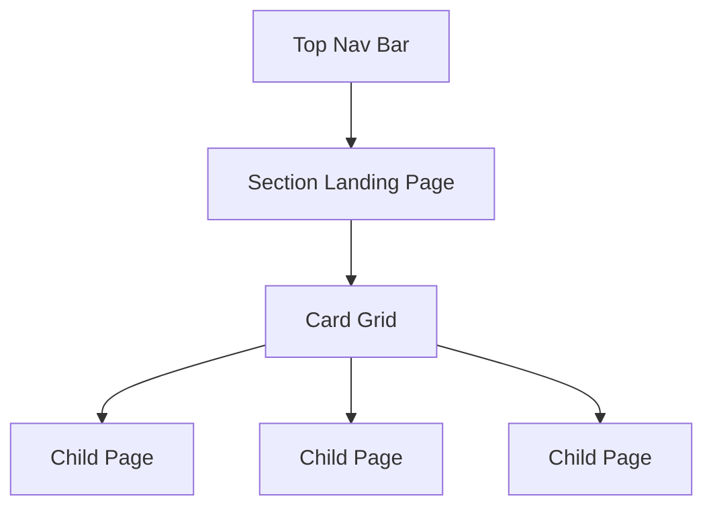

# Navigation

How the top nav bar and auto-generated landing pages work together to help users discover content.

## Overview

Navigation in zpress has two layers: the **top navigation bar** that provides quick access to major documentation areas, and **landing pages** that are auto-generated for sections with children. The nav bar controls top-level wayfinding. Landing pages provide section-level entry points with card grids.



## Top Navigation Bar

### Auto navigation

Set `nav: 'auto'` (the default) to generate one nav item per non-isolated top-level section:

```ts
export default defineConfig({
  sections: [
    { title: 'Getting Started', path: '/getting-started', include: 'docs/getting-started.md' },
    { title: 'Guides', path: '/guides', include: 'docs/guides/*.md' },
    { title: 'Reference', path: '/reference', include: 'docs/reference/*.md' },
  ],
  nav: 'auto',
})
```

This produces three nav items: Getting Started, Guides, and Reference. Sections with `standalone: true` are excluded from auto-generated nav.

### Explicit navigation

Pass an array of `NavItem` objects for full control:

```ts
nav: [
  { title: 'Guides', link: '/guides/content' },
  { title: 'Reference', link: '/reference/configuration' },
]
```

### Dropdown menus

Nav items with `items` instead of `link` render as dropdown menus:

```ts
nav: [
  {
    title: 'API',
    items: [
      { title: 'REST API', link: '/api/rest' },
      { title: 'GraphQL', link: '/api/graphql' },
    ],
  },
]
```

### Active state

In auto mode, nav items highlight based on the current URL matching the section's `path`. For explicit nav, use `activeMatch`:

```ts
{ title: 'API', link: '/api/overview', activeMatch: '/api/' }
```

The `activeMatch` value is a regex pattern tested against the current URL path.

## Landing Pages

Sections with children but no explicit page source automatically get a generated landing page displaying cards that link to child entries.

### When landing pages generate

A landing page is created when a section has:

- A `path` field (defines the landing page URL)
- Child entries (via `items` or glob `include`)
- No `include` pointing to a single file (that would make it a regular page)

```ts
{
  title: 'Guides',
  path: '/guides',
  include: 'docs/guides/*.md',
}
```

Navigating to `/guides` shows a landing page with cards for each discovered guide.

### Landing page modes

The `landing` field controls how the page is generated:

| Mode         | Behavior                                                                                |
| ------------ | --------------------------------------------------------------------------------------- |
| `'auto'`     | Default. Card-style if the section has children, overview-style if it has an index file |
| `'cards'`    | Always generates a card grid linking to child entries                                   |
| `'overview'` | Always uses the promoted index file content as the landing page                         |
| `false`      | Disables landing page generation entirely                                               |

```ts
{
  title: 'Guides',
  path: '/guides',
  include: 'docs/guides/*.md',
  landing: 'cards',
}
```

### Overview file promotion

When using `recursive: true`, the `entryFile` field controls which filename is promoted to the section header (default: `"overview"`). That file's content becomes the section's landing page instead of auto-generated cards.

```ts
{
  title: 'Reference',
  path: '/reference',
  include: 'docs/reference/**/*.md',
  recursive: true,
  entryFile: 'overview',
}
```

### Section cards

Sections without workspace metadata display simple cards showing:

- Entry name (from `title`)
- Description (from child page frontmatter `description`)
- Icon colors that rotate automatically across cards

### Workspace cards

When workspace metadata (from `workspaces`) matches a section by `path`, the landing page uses workspace-style cards showing:

- Icon with color styling
- Scope label (e.g. `apps/`)
- Name and description
- Technology tag badges
- Optional deploy badge

See the [Workspaces](/concepts/workspaces) concept for workspace configuration.

### Controlling card content

Card descriptions are resolved in this order (highest priority first):

1. `card.description` on the entry
2. `description` from the entry's frontmatter
3. Auto-extracted description from the page content

```ts
{
  title: 'API Docs',
  path: '/api',
  include: 'docs/api/overview.md',
  card: {
    description: 'Complete API reference with examples',
    icon: 'pixelarticons:terminal',
  },
}
```

## Design Decisions

- **Auto nav as default** — most sites want one nav item per top-level section. Auto mode eliminates boilerplate while explicit mode provides full control when needed.
- **Landing pages over empty sections** — sections with children should never show a blank page. Auto-generated card grids give users an immediate overview of what's inside.
- **Workspace-aware cards** — when monorepo metadata exists, landing pages use richer cards with icons, tags, and badges rather than plain text links.

## References

- [Configuration reference — NavItem](/reference/configuration#navitem)
- [Configuration reference — CardConfig](/reference/configuration#cardconfig)
- [Workspaces](/concepts/workspaces) — monorepo workspace metadata
- [Content](/concepts/content) — sections and page definitions
