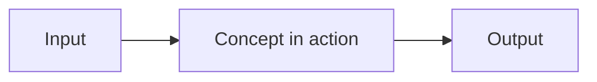

# Concept Template

Template for explanation docs — understanding-oriented documentation that covers the "what" and "why" of a system behavior, mechanism, or domain concept.

## Rules

- H1 is a single noun or short phrase — the concept name
- One-liner immediately after H1 — what this concept is and what role it plays
- One concept per document — if you're covering two ideas, split into two docs
- Inverted pyramid — start broad (definition, scope), narrow into detail
- Answer "why" — rationale, design reasoning, tradeoffs, alternatives considered
- Use analogies and concrete examples to bridge abstract ideas
- Diagrams encouraged — place near the top, under the overview
- No step-by-step instructions — link to how-to guides
- No API signatures or field tables — link to reference docs
- No marketing or persuasive language — explain, don't sell
- Lead with a definition — the first sentence of Overview should complete the phrase "X is..."
- Max 5 links per group in References

## Structure

| Section              | Required | Description                                           |
| -------------------- | -------- | ----------------------------------------------------- |
| H1 concept name      | yes      | Single noun or short phrase                           |
| One-liner            | yes      | What this concept is and what role it plays           |
| Overview             | yes      | Definition, scope, and mental model                   |
| Diagram              | no       | Visual aid (flowchart, architecture, decision tree)   |
| Key Terms            | no       | Domain-specific vocabulary                            |
| Background           | no       | Context, history, or prior art                        |
| Body sections        | yes      | H2 headings that unpack the concept (flexible naming) |
| When to Use          | no       | Conditions for choosing this approach                 |
| Comparing Approaches | no       | Variants, alternatives, or competing strategies       |
| Design Decisions     | yes      | Why it works this way, alternatives considered        |
| References           | yes      | Curated links grouped by type                         |

## Template

````markdown
# Concept Name

What this concept is and what role it plays in one sentence.

## Overview

Define the concept in 1-3 sentences. State what it does, why it exists, and where its boundaries are — what this document covers and what it does not.



## Key Terms

- **Term A** — what it means in this context
- **Term B** — what it means in this context

## How It Works

What this aspect of the concept involves. Use concrete examples and analogies to make abstract ideas tangible.

### Sub-Aspect

Deeper detail on a sub-topic. Only go as deep as the reader needs to build a working mental model.

## Design Decisions

- **Decision A** — why this approach was chosen over the alternative. What tradeoff it makes.
- **Decision B** — why this constraint exists and what it enables.

## References

- [How-to guide title](../link) — task-oriented guide for applying this concept
- [Reference title](../link) — canonical type definitions related to this concept
- [Other concept title](../link) — related concept that complements this one
````

## References

- [Types](/framework/types) — the seven doc types
- [Diataxis — Explanation](https://diataxis.fr/explanation/) — framework reference
- [The Good Docs Project — Concept](https://www.thegooddocsproject.dev/template/concept) — community template patterns
