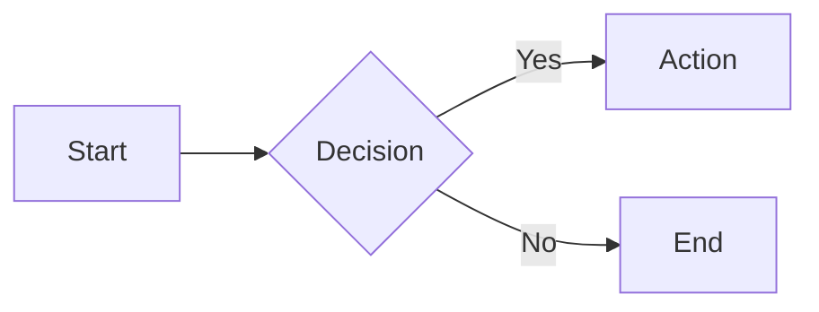
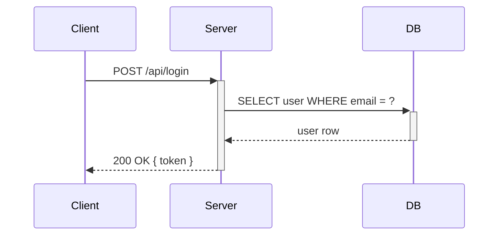
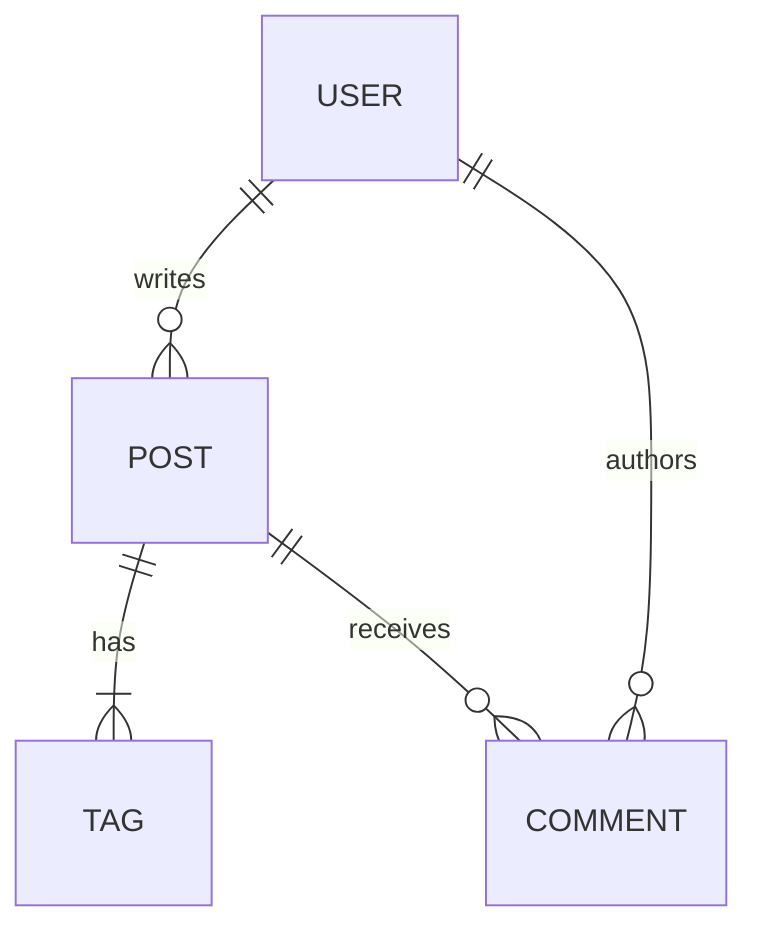
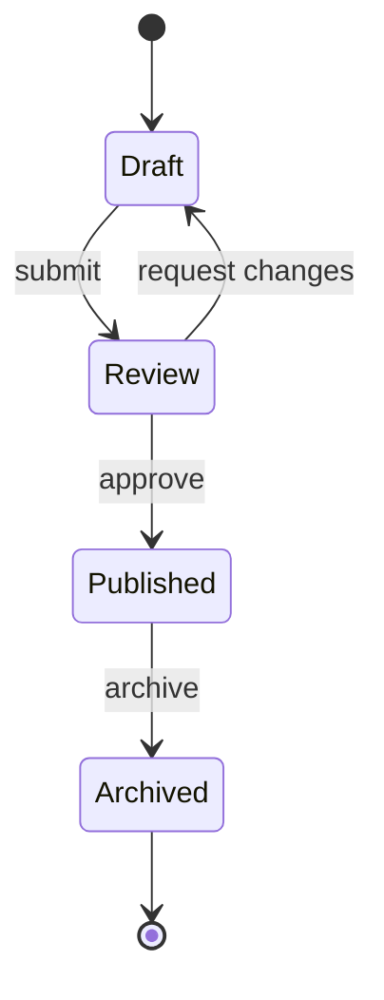
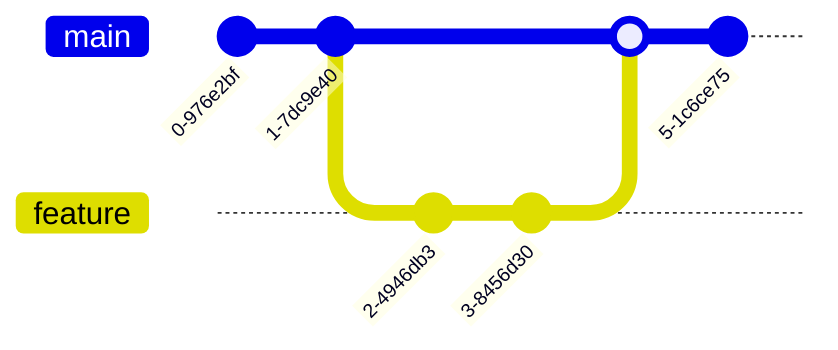
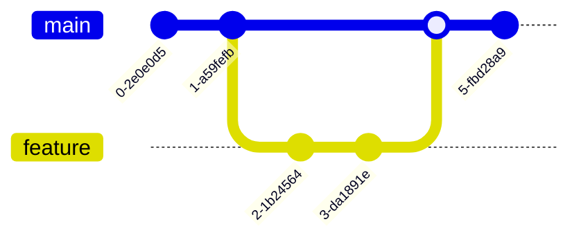
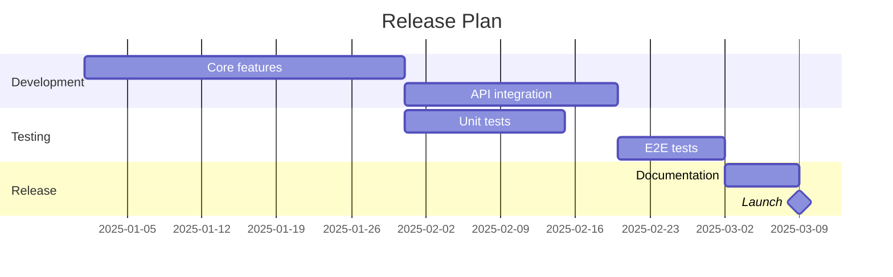
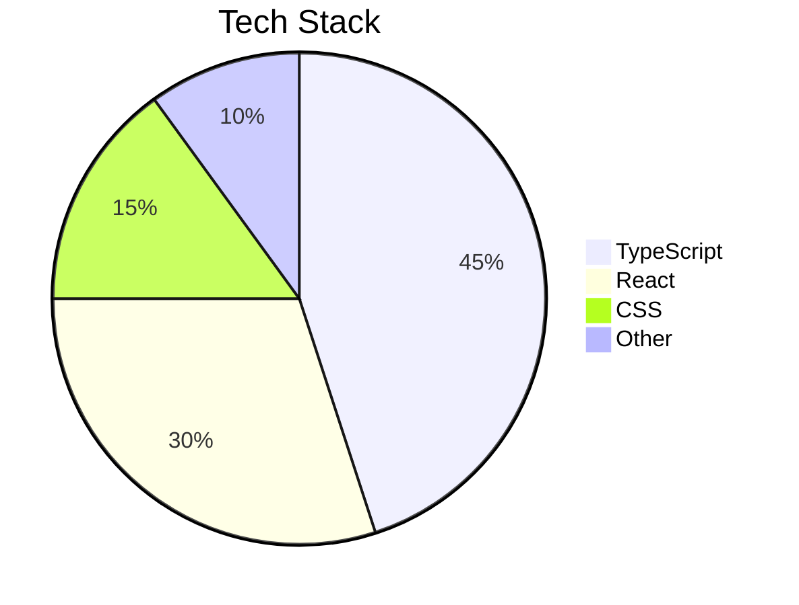

# Mermaid Diagrams

zpress bundles `rspress-plugin-mermaid` so any fenced code block with the `mermaid` language renders as a diagram. No configuration required.

## Flowchart

**Code**

````md

````

**Output**


## Sequence diagram

**Code**

````md

````

**Output**


## Entity relationship

**Code**

````md

````

**Output**


## State diagram

**Code**

````md

````

**Output**


## Git graph

**Code**

````md

````

**Output**



## Gantt chart

**Code**

````md

````

**Output**


## Pie chart

**Code**

````md

````

**Output**


## All supported types

| Type                | Directive              |
| ------------------- | ---------------------- |
| Flowchart           | `graph` or `flowchart` |
| Sequence            | `sequenceDiagram`      |
| Class               | `classDiagram`         |
| State               | `stateDiagram-v2`      |
| Entity Relationship | `erDiagram`            |
| Gantt               | `gantt`                |
| Pie                 | `pie`                  |
| Git Graph           | `gitGraph`             |
| Mindmap             | `mindmap`              |
| Timeline            | `timeline`             |

## References

- [Mermaid documentation](https://mermaid.js.org/intro/)
