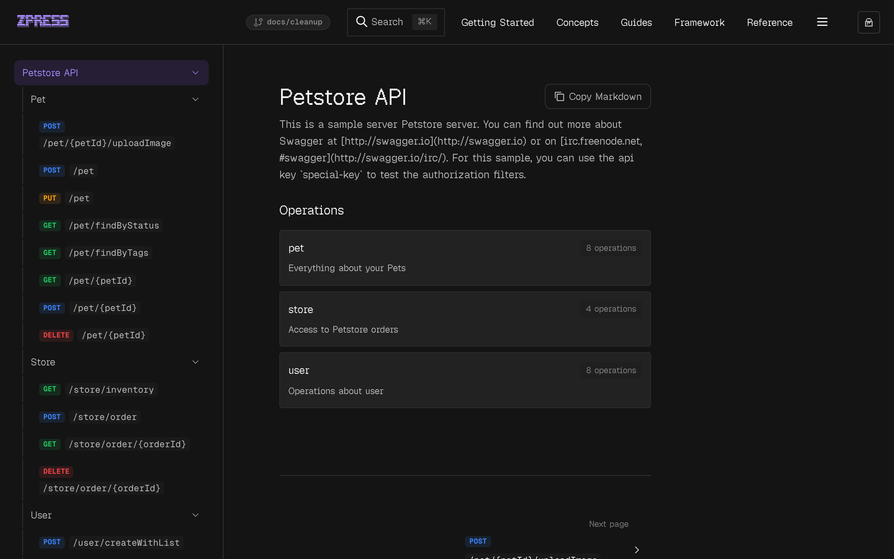
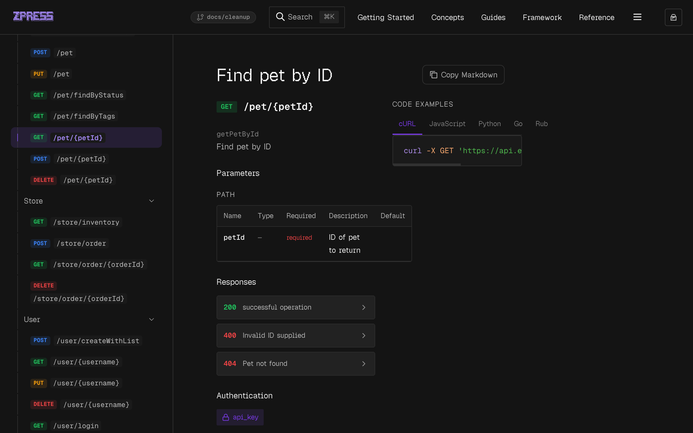

import { BrowserWindow } from '@theme'

# OpenAPI

Drop an OpenAPI spec into your config and zpress generates a full API reference — overview page, per-operation pages, and sidebar entries.

See the [Petstore API Reference](/petstore) for a live example.

## Configuration

Add `openapi` to your root config or to any workspace item:

```ts
export default defineConfig({
  openapi: {
    spec: 'openapi.json',
    path: '/api',
  },
})
```

| Option | Type | Required | Default | Description |
| --- | --- | --- | --- | --- |
| `spec` | `string` | yes | — | Path to the OpenAPI JSON or YAML file, relative to repo root |
| `path` | `string` | yes | — | URL path for generated pages (e.g. `'/api'`) |
| `title` | `string` | no | `'API Reference'` | Sidebar group title and overview page heading |
| `sidebarLayout` | `'method-path' \| 'title'` | no | `'method-path'` | How operations appear in the sidebar |

## What gets generated

During `zpress sync`, the spec is fully dereferenced (all `$ref`s resolved) and three types of files are written:

| File | Description |
| --- | --- |
| `{path}/openapi.json` | The dereferenced spec as JSON |
| `{path}/index.mdx` | Overview page with API info, servers, auth schemes, and operation summary |
| `{path}/{operation}.mdx` | One page per operation with full spec details and code examples |

Operations are extracted from `paths`, grouped by their first tag, and slugified from `operationId`. If no `operationId` exists, the slug is derived from the method and path.

### Overview page

The overview page renders API title, version, description, server URLs, authentication schemes, and a summary of operations grouped by tag.

<BrowserWindow url="https://docs.example.com/petstore">
  
</BrowserWindow>

### Operation page

Each operation gets a two-column layout with spec details on the left (parameters, request body, responses, security) and auto-generated code examples on the right (cURL, JavaScript, Python, Go, Ruby, Java).

<BrowserWindow url="https://docs.example.com/petstore/getpetbyid">
  
</BrowserWindow>

## Sidebar layout modes

### `method-path` (default)

Each sidebar entry shows a colored method badge and the path in monospace.

<BrowserWindow url="https://docs.example.com/petstore">
  
</BrowserWindow>

### `title`

Each sidebar entry shows the operation's `summary` as plain text instead of the method and path.

## Per-workspace OpenAPI

Attach an OpenAPI spec to any workspace item for per-package API docs:

```ts title="zpress.config.ts"
export default defineConfig({
  workspaces: [
    {
      title: '@acme/api',
      path: '/packages/api',
      openapi: {
        spec: 'packages/api/openapi.yaml',
        path: '/packages/api/reference',
        title: 'API Reference',
        sidebarLayout: 'title',
      },
      items: [
        { title: 'Overview', path: '/packages/api', include: 'packages/api/README.md' },
      ],
    },
  ],
})
```

## References

- [Petstore API Reference — live demo](/petstore)
- [Content — async generators](/concepts/content)
- [Configuration reference](/reference/configuration)
